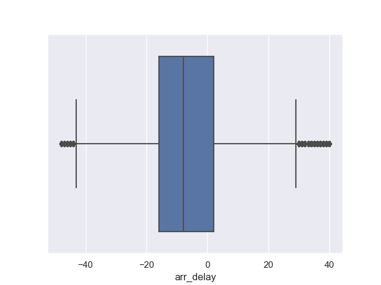

# Predicting Flight Delays

### Lighthouse Labs, Midterm Project.

##### January 13, 2023. Terre Leung, Tetiana Fesenko, and Jamie Dormaar

---

## Project/Goals

To

1. Generate statistical analysis and machine learning models to predict the arrival delay of commercial flights.

## Process

Steps followed:

1. Establish a connection with the AWS server.
1. Explore the source data tables with SQL queries for initial basic data familiarization.
1. Once satisfied with the appropriate data volume and content, it was saved to a .csv file from which we could work with in python pandas.
1. Data exploration and Feature Engineering was generated through the questions detailed in the EDA notebook provided as well as some curiosities of our own.
1. Data cleaning was nearly continuous, but predominantly was focused on prior to fitting ML models to the data.
1. Dimensionality reduction and variable selection were done as they were relevant to the Machine Learning models imported from sklearn modules.

## Images:

### Target Variable Arrival Delay: Normalization

the Gaussean distribution of the arrival delay was further supported by a Shapiro Wilk test equal to 1 and a mean value near 0.

### Outlier management:

Outliers were addressed by 1.5 \* the IQR method:

A monlthy display of the central tendencies of Arrival Delay distributions.

Despite not being overly informative, this graph is a visually appealing graphical visualization, which illustrates rather surprisingly the absence of seasonal delay trends.

### XGBoost:

XGBoost hierarchy bar graph illustrating the importance of the parameters

## Challenges

- Collecting the weather data from the World weather online network took careful planing and a significant amount of time for the get requests to be sent and received, approx 6-7 hours for 87000 records. Errors made in this query were costly, and as a result we learned to be much more careful and precise with the specificity of our request.
- Setting up and maintaining two functional python working environments to alow the above mentioned get-request to execute undisturbed.
- Sharing Jupyter Notebooks through git was a wonderfully intense learning curve!

## Future Goals

1. There are so many other ways this data could have been manipulated with seemingly endless options for various feature engineering opportunities, that it would have been fun to more thoroughly explore a few more of these rabbit holes.
1. Trial more machine learning models on various iterations of the same data, not only to better evaluate how well they fit the data, and are capable of generating predictions, but also to better familiarize with the pros, cons, and best use-cases for each type of model.
1. Given the opportunity to have "tried it all over again", we would have spent more time at the very beginning building a plan, and detailing out how we would complete it.
